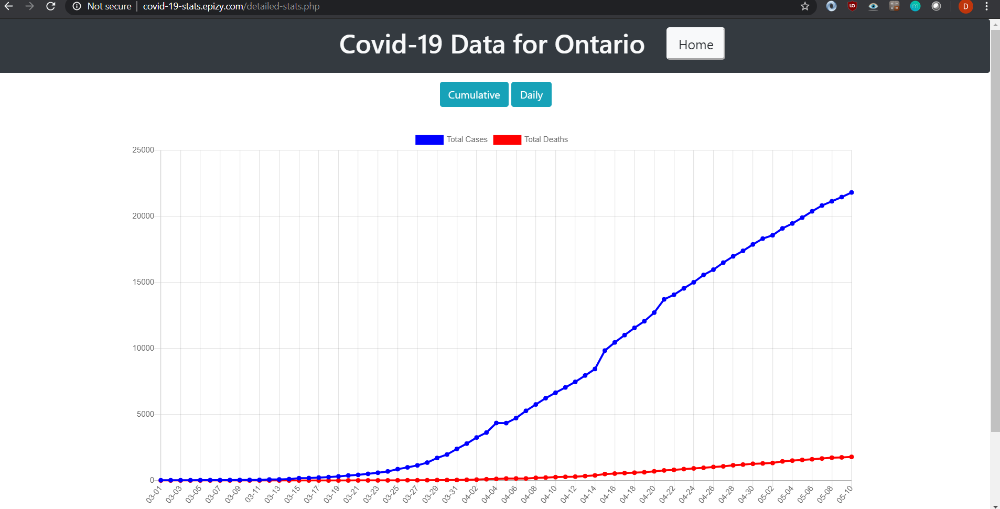

# Covid Dashboard

This is a web app that displays Covid-19 statistics, mostly focused on Canadian statistics. Each Canadian Province/Territory has its own section along with associated charts that display cumulative and daily statistics. The site is located <a href="http://covid-19-stats.epizy.com/"> here. </a>

## How it Looks

The home page:

One of the chart pages:

## API's Used

* covid-19-data.p.rapidapi.com
* api.covid19api.com
* api.covid19tracker.ca

*Please note that some stats may not be visible during some parts of the day due to an API updating.*